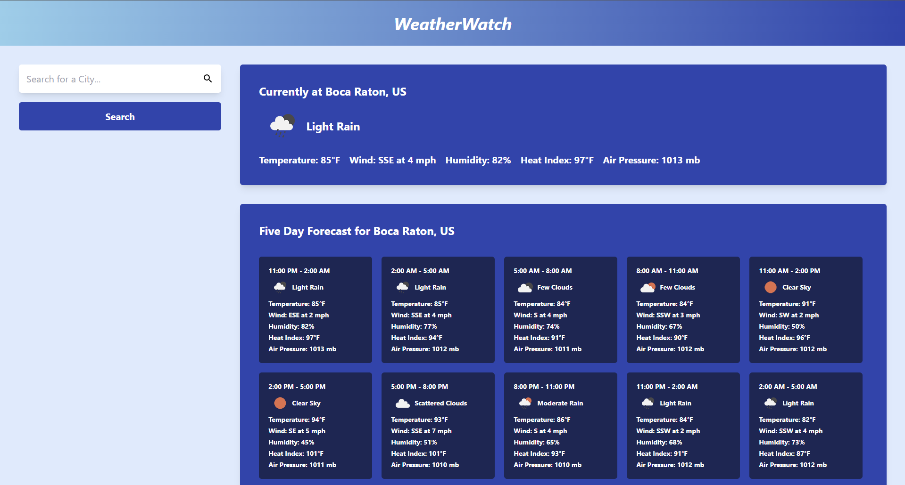

# Weatherboy

## Table of contents

- [Description](#description)
- [Features](#features)
- [Tech stack](#tech-stack)
- [Prerequisites](#prerequisites)
- [Installation](#installation)
- [Environment variables](#environment-variables)
- [Scripts](#scripts)
- [Local development](#local-development)
- [Build and preview](#build-and-preview)
- [Deploy to GitHub Pages](#deploy-to-github-pages)
- [License](#license)

## Description

A web client that shows current conditions and forecasts for your location and for cities worldwide. Search uses autocomplete; an interactive map shows satellite-derived weather layers globally.

[](https://mikematics22800.github.io/weatherboy/)

## Features

- Current weather and multi-day forecast (OpenWeather)
- City search with suggestions
- Geolocation for “near me”
- Google Maps–based map with weather overlays
- Charts for forecast data (Chart.js)

## Tech stack

| Area        | Libraries / tools |
|------------|-------------------|
| UI         | React 18, Material UI, Emotion, Tailwind CSS |
| Routing    | React Router (with a `/weatherboy/` basename for GitHub Pages) |
| Build      | Vite 5 |
| Maps       | Google Maps Platform (`@react-google-maps/api`, `@vis.gl/react-google-maps`) |
| Animation  | GSAP |
| Charts     | Chart.js via `react-chartjs-2` |

## Prerequisites

- **Node.js** (current LTS is recommended) and npm
- **OpenWeather** API key — [openweathermap.org](https://openweathermap.org/)
- **Google Maps Platform** API key with Maps JavaScript API (and any APIs you enable for your map layers) — [Google Maps Platform](https://developers.google.com/maps)

## Installation

```bash
git clone https://github.com/mikematics22800/Weatherboy.git
cd Weatherboy
npm install
```

Create a `.env` file in the project root (see [Environment variables](#environment-variables)), then start the app.

## Environment variables

Vite exposes only variables prefixed with `VITE_`. This project uses:

| Variable | Purpose |
|----------|---------|
| `VITE_OWM_KEY` | OpenWeather API key (weather, forecast, reverse geocoding) |
| `VITE_GOOGLE_MAPS_API_KEY` | Google Maps JavaScript API key |

Example `.env`:

```env
VITE_OWM_KEY=your_openweather_key
VITE_GOOGLE_MAPS_API_KEY=your_google_maps_key
```

Restart the dev server after changing `.env`.

## Scripts

| Command | Description |
|---------|-------------|
| `npm run dev` | Start the Vite dev server |
| `npm run build` | Production build to `dist/` |
| `npm run preview` | Serve the production build locally |
| `npm run lint` | Run ESLint |
| `npm run deploy` | Build, then publish `dist/` to the `gh-pages` branch (see below) |

Running `npm run deploy` automatically runs `predeploy` (`npm run build`) first.

## Local development

```bash
npm run dev
```

Open **http://localhost:5173/Weatherboy/** in your browser. The app is configured with `base: "/weatherboy/"` in Vite so paths match the GitHub Pages project URL.

## Build and preview

```bash
npm run build
npm run preview
```

Preview serves the contents of `dist/`; use the URL Vite prints (still under the `/weatherboy/` base).

## Deploy to GitHub Pages

This repo is set up for a **project site** at `https://<user>.github.io/<repo>/`.

1. In the GitHub repository: **Settings → Pages → Build and deployment**, set the source to the **`gh-pages`** branch (folder `/` or root).
2. Ensure `vite.config.js` uses `base: "/weatherboy/"` and that it matches your repository name segment in the GitHub Pages URL (case-sensitive path segment).
3. From your machine (with `git` configured for this remote):

```bash
npm run deploy
```

That runs a production build and pushes `dist/` to the `gh-pages` branch using the [gh-pages](https://github.com/tschaub/gh-pages) package. Dotfiles in `dist/` (such as `.nojekyll` from `public/`) are included via `--dotfiles` so GitHub Pages does not run Jekyll in a way that breaks the app.

**Note:** Deploying requires permission to push to the remote repository. If you use two-factor authentication, use a [personal access token](https://docs.github.com/en/authentication/keeping-your-account-and-data-secure/creating-a-personal-access-token) or SSH, not a password, when Git prompts for credentials.

## License

[](https://opensource.org/licenses/ISC)
